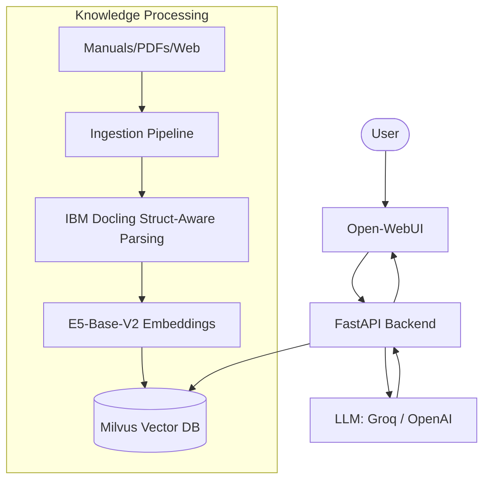

# Project Summary: Classroom CS RAG (Phase 1)

This project is a complete **Retrieval-Augmented Generation (RAG)** system designed for Kaiser Permanente customer service. It converts large volumes of provider manuals and FAQs into a searchable assistant that provides accurate, context-aware answers to support agents.

---

## 🏗️ Core Architecture

The system follows a modern, modular RAG architecture:

---

## 📂 Key Components & Modules

### 1. **Data Ingestion & Processing**
- **IBM Docling**: Used for structure-aware parsing of PDFs and HTML, preserving table integrity and section hierarchies.
- **Multimodal Support**: Processes PDF, HTML, JSON, and Text files.
- **Metadata Layer**: Every piece of data is tagged with `tenant_id`, `document_id`, and `access_permissions` for future multi-tenant support.

### 2. **Vector Retrieval**
- **Milvus Vector DB**: Stores 768-dimensional vectors with high-performance search (< 150ms).
- **Embedding Model**: Uses `intfloat/e5-base-v2`, optimized for CPU/local deployment.

### 3. **Application & UI**
- **FastAPI Backend**: Orchestrates the RAG logic, handles chat history, and manages LLM provider routing.
- **Open-WebUI**: A premium, production-ready interface for chatting with the models.

### 4. **Observability & Evaluation (Latest Additions)**
- **RAGAS Evaluation**: A full evaluation pipeline measuring `Faithfulness`, `Answer Relevancy`, and `Context Recall` using a **Golden Set** ground truth dataset.
- **Prometheus & Grafana**: Live dashboard tracking request rates, p99 latency (broken down by embed/retrieve/llm phases), and chunk retrieval counts.
- **Drift Monitoring**: A weekly automated probe that alerts if the quality of RAG answers drops compared to the baseline.

---

## 🛠️ Technology Stack

| Category | Tools |
|---|---|
| **LLMs** | Groq (Llama 3.3), OpenAI (GPT-4o) |
| **Vector DB** | Milvus Standalone |
| **Metadata DB** | PostgreSQL |
| **Parsing** | IBM Docling, Selenium, BeautifulSoup |
| **Evaluation** | RAGAS, Datasets library |
| **Monitoring** | Prometheus, Grafana |
| **Infrastructure** | Docker, Docker Compose, ArgoCD (K8s ready) |

---

## 🚀 Recent Accomplishments
- ✅ **Infrastructure Fixes**: Resolved pathing issues and restarted all containers for 24/7 uptime.
- ✅ **Ground Truth Expansion**: Built a robust 11-question golden set with detailed manuals-based ground truth.
- ✅ **Monitoring Stack**: Fully deployed Prometheus and Grafana with pre-configured RAG dashboards.
- ✅ **Drift detection**: Implemented a baseline-based alerting system to prevent quality degradation.

---

## 📍 How to use it
- **Admin Portal**: [http://localhost:8080](http://localhost:8080)
- **Monitoring**: [http://localhost:3001](http://localhost:3001) (Grafana)
- **Docs**: [http://localhost:8000/docs](http://localhost:8000/docs)
