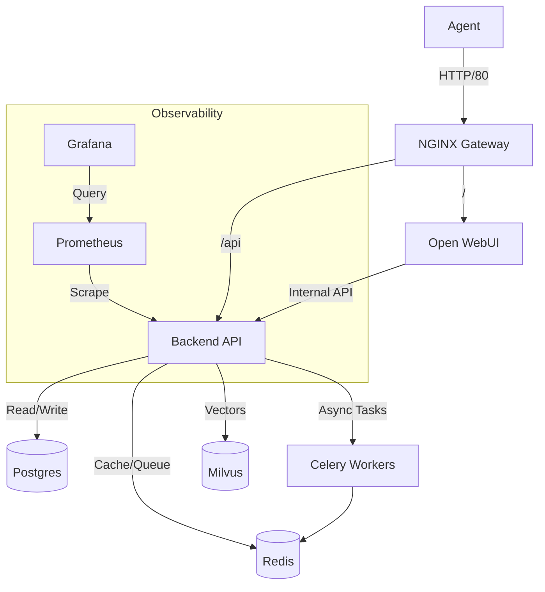

# Classroom Customer Service RAG - Phase 1

**Kaiser Customer Call Center Agent**

This project implements Phase 1 of the Retrieval Augmented Generation (RAG) system for the Kaiser Customer Call Center. It is designed to assist agents by providing accurate, context-aware answers derived from internal documentation.

---

## 💡 The Idea

Customer service agents often struggle to find the right information quickly across multiple disconnected knowledge bases. This project unifies these sources into a single RAG pipeline.

**Phase 1 Goals:**
*   **Ingestion**: Process PDFs and other docs into a vector store.
*   **Retrieval**: Semantic search using vector embeddings.
*   **Generation**: LLM-based answer synthesis with citations.
*   **Interface**: A user-friendly chat interface for agents.

---

## 🏗 Design & Architecture

The system follows a microservices architecture orchestrated via Docker Compose.



### Components

*   **API Gateway (Nginx)**: Entry point for all traffic. Handles routing and basic security.
*   **Frontend (Open WebUI)**: customized interface for chat interactions.
*   **Backend (FastAPI)**: Core logic for RAG, ingestion, and management.
    *   **Services**: Modularized logic for ingestion, retrieval, generation.
    *   **API**: RESTful endpoints for all operations.
*   **Data Layer**:
    *   **Postgres**: Relational data (Tenants, Chat History).
    *   **Redis**: Caching and Celery message broker.
    *   **Milvus**: High-performance vector database.

---

## 📂 Folder Structure

How to navigate the codebase:

```text
.
├── backend/                # Core Application
│   ├── app/
│   │   ├── api/v1/         # Endpoints (chat, ingest, admin, etc.)
│   │   ├── core/           # Config & Settings
│   │   ├── services/       # RAG logic (ingestion, retrieval, generation)
│   │   └── workers/        # Celery task definitions
│   ├── scripts/            # Maintenance scripts (reindex, backfill)
│   └── tests/              # Unit and Integration tests
├── open-webui/             # Frontend Configuration
│   └── pipelines/          # Custom RAG pipeline logic
├── gateway/                # Nginx Configuration
├── evaluation/             # RAGAS datasets & runners
├── observability/          # Prometheus & Grafana configs
├── init_data/              # Database schema seeds
├── infrastructure/         # IaC (Termination, Helm) files
├── docker-compose.yml      # Main stack definition
└── Makefile                # Developer shortcuts
```

---

## 🚀 How to Run

### Prerequisites
*   Docker & Docker Compose
*   Make (optional)

### 1. Configuration
Copy the template and fill in your secrets (OpenAI API Key, Database creds).
```bash
cp .env.example .env
```

### 2. Start the Stack
This spins up the Gateway, Backend, Frontend, Databases, and Observability tools.
```bash
make up
# OR
docker-compose -f docker-compose.yml -f docker-compose.ops.yml up -d --build
```

### 3. Access
*   **Application**: [http://localhost:8080](http://localhost:8080)
*   **API Documentation**: [http://localhost:8080/docs](http://localhost:8080/docs)
*   **Grafana**: [http://localhost:3001](http://localhost:3001)

---

## 📖 How to Use

### For Developers
1.  **Ingestion**: Use the `/api/v1/ingest` endpoint to trigger document processing.
2.  **Chat**: Use the `/api/v1/chat/completions` endpoint for OpenAI-compatible chat.
3.  **Admin**: Manage tenants via `/api/v1/tenants`.

### For Agents
1.  Log in to the Web UI.
2.  Select the **RAG Pipeline** model.
3.  Ask questions about Kaiser policies.

---

## 🧪 How to Test

### Automated Tests
Run the pytest suite within the backend container:
```bash
make test
```

### Evaluation
Run RAGAS metrics against the golden dataset:
```bash
docker-compose exec backend python -m evaluation.runners.ragas_runner
```

---

## 🚢 How to Deploy

### Docker Compose (Single Node)
The provided `docker-compose.yml` is production-ready for single-node deployments. Ensure `.env` is secure and `debug` mode is off.

### Kubernetes (Helm)
For scaling, use the charts in the `infrastructure/helm` directory (placeholder).
1.  Build images and push to registry.
2.  Update `values.yaml` with image tags.
3.  `helm install rag-app ./infrastructure/helm/rag-chart`

---

## 🛠 Maintenance

*   **Reindexing**: `python backend/scripts/reindex_documents.py`
*   **Backups**: `docker-compose exec postgres pg_dump -U user ragdb > backup.sql`
